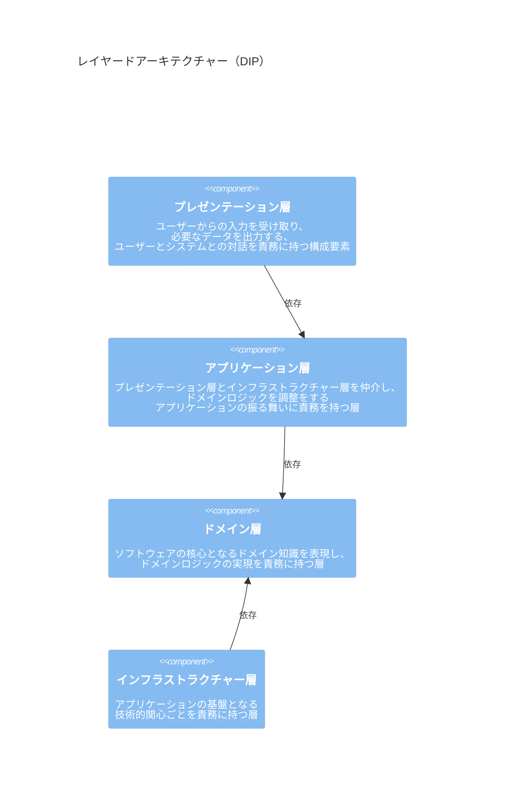

## この記事を読んで分かること

- ドメイン駆動設計とはどのような開発手法か
  - ドメインとは何か
  - ドメインロジックとはどのような処理を指すのか
- ドメイン駆動設計は何を目的としているのか

## この記事では触れないこと

- 具体的な設計パターンの解説
  - 値オブジェクトや集約、アーキテクチャーなど
- モデリングの方法についての解説

## ドメイン駆動設計とは

1. [ソフトウェアが解決しようとしている問題（ドメイン）](#ドメインとは)のうち、
2. [解決することで最も事業価値を高める問題に注力](#ドメインの中核にある複雑さと機会にフォーカスする)して、
3. [問題を解決することに適した、変更に柔軟なモデル（ドメインモデル）](#良いモデルとは)を、
4. [ドメインに精通したプロジェクトメンバー（ドメインエキスパート）と開発者が協働して構築](#ドメインエキスパートとソフトウェアエキスパートが協働してモデルを探求する)し、
5. [そのモデルを明示的に表現した実装](#それらのモデルを明示的に表現するソフトウェアを作成する)をして、
6. [モデルを開発プロセスの中で最も信頼できる情報源](#モデル駆動設計)としながら、
7. [継続的にモデルと実装を改善し続け](#アジャイル開発)、
8. [ソフトウェアの価値を高めて継続的なプロジェクトの成功を目指す](#ドメイン駆動設計の目的)開発手法のこと

## ドメインとは

ドメインとは、ソフトウェアが解決しようとしている、ユーザーの知識や影響力、活動の領域のこと[^1]を指します。

例えばオンラインショッピングシステムの場合、商品管理や顧客注文処理などがドメインに当たります。ソフトウェアが扱う特定の問題や関連する業務の領域と言い換えても良いでしょう。

このドメインは、ソフトウェアによって対象とする問題領域が異なるため、ソフトウェアごとに扱うドメインもまた異なります。

そもそもソフトウェアは、現実世界に存在するユーザーの何らかの問題を解決するために存在します。ソフトウェアは問題、つまりドメインなしには存在し得ません。

ドメイン駆動設計では、このドメインをソフトウェア開発の中心に据えて、ユーザーの問題を解決するソフトウェアの開発を試みます。

### ドメインロジックとは

ドメインロジック（ビジネスロジック）とは、ドメイン知識を反映した処理を指します。ドメイン知識には**ソフトウェア化する対象領域に存在するルールや制約、業務内容**を含み、ソフトウェアが存在しなくとも発生するような処理がこれにあたります。

つまり次のような内容の具体的な処理はドメインロジックとは言えません。

- UI に◯◯を表示する
- URL のパラメータによって◯◯をする
- 別のプロダクトへリダイレクトする
- 通知メールを送信する
- Cookie を読んで◯◯をする
- API をコールしてデータを保存/取得/更新/削除する
- DB にデータを保存/取得/更新/削除する

<!-- textlint-disable ja-technical-writing/sentence-length -->

これらの処理はドメインとは無関係な理由により変更される可能性がある処理です。例えば、API や DB、UI の変更、Cookie からトークンへの変更、メール以外の通知手段への変更などは、ドメインとは別の理由によって変更される可能性があります^[もちろんドメインの変更に伴い、これらの処理の変更が必要となるケースもあります。ですが、これらの処理の変更はドメインに変更を与えることはありません。]。

言い換えれば、ドメインの変更以外の理由で変更される具体的な処理はドメインロジックではありません^[実際にはリポジトリパターンやイベントパターンによって抽象化された形でドメインロジックに含まれる可能性はあります。ですがその場合でもこれらの具体的な処理内容は抽象化し、具体的にどのような処理をしているかはドメインロジックからは隠蔽することが必要です。]。

<!-- textlint-enable ja-technical-writing/sentence-length -->

## ドメイン駆動設計の目的

ドメイン駆動設計の目指すゴールは、**ソフトウェアの価値を高めて、プロジェクトの成功を持続的に支援すること**にあります。

<!-- textlint-disable ja-technical-writing/sentence-length -->

このソフトウェアの価値には次の2つの側面があり^[書籍「Clean Architecture 達人に学ぶソフトウェアの構造と設計」第2章「2つの価値のお話」より。]、どちらの価値もプロジェクトを持続的な成功へ導くために必要な価値となります。

<!-- textlint-enable ja-technical-writing/sentence-length -->

- **役に立つソフトウェアを実現すること**: ソフトウェアがユーザーの問題を効果的かつ的確に解決し、ユーザーにとって役に立つこと
- **ソフトウェアを迅速に変更できること**: 環境やニーズの変化に対してソフトウェアを迅速かつ柔軟に変更できること

<!-- TODO: ドメイン駆動設計の目指すゴール。2つの価値によりプロジェクトを持続的な成功へ導くことを説明する画像を挿入する -->

@[card](https://qiita.com/MinoDriven/items/39103fba2c7bb8f01e5c)

## ドメイン駆動設計の問題解決アプローチ

ドメイン駆動設計では、**モデリングから利益を最大に引き出す[^1]アプローチ**を取り、問題の解決を試みます。

Evans 氏は過去のソフトウェア開発の経験とドメイン駆動設計について、次のように説明しています。

> 多くのプロジェクトは、モデリングを行っても最終的に大きな利益を得られないまま終わった。
> ドメイン駆動設計は、モデリングから劇的な利益を得られたプロジェクトから、成功したパターンを抽出したものだ。

それまでの多くのプロジェクトでは、分析、設計、実装といったプロセスが分断されやすい開発プロセス（ウォーターフォール型など）が一般的でした。分断されやすい開発プロセスでは、モデリングをしていてもそのモデルを活用しきれない、つまり大きな利益を得られない問題がありました。

@[card](https://zenn.dev/backstage/articles/8e7a574d8c26a1#なぜドメイン駆動設計は生まれたのか？)

例えば、分析者が構築したモデルは柔軟な変更を可能とするモデルになっているとは限りません。そのためほとんどの場合に設計フェーズで違う姿にモデリングし直されてしまいます。同様に実装においても、設計モデルから実装しやすいように形が変わってしまう可能性もあります。

*分断された開発プロセスの問題*

つまりドメイン駆動設計とは、このような問題が起きなかった**モデリングから利益を得られたプロジェクトで成功したパターンをまとめたもの**と言えます。

<!-- この成功したパターンを簡単に表すと、ドメインの理解、ドメインモデリング、実装の3つを密に連携しものとなります。 -->

<!-- TODO: ドメイン駆動設計のプロセスを説明する画像を挿入 -->

### 戦略的設計と戦術的設計

モデリングから利益を得られたパターンは、大きく次の2つに分類されます。

- **戦略的設計**: ドメインを深く理解し、良いモデルを構築するための、ドメインを俯瞰して全体感を捉えるモデリングのためのパターン
  - ドメインをより深く理解し、継続的なモデルの改善に不可欠
  - ユビキタス言語、サブドメイン、境界付けられたコンテキストなど
- **戦術的設計**: 実装に目線をおいた、良いモデルを構築するための設計パターン
  - 戦略的設計をするための基本的な構成要素となり、戦略的設計を活用するために不可欠
  - 継続的なモデルの変更に耐えることができる設計パターン
  - アーキテクチャー、エンティティ、値オブジェクト、集約、リポジトリなど

先程の3つの要素を当てはめると、次のようになります。

<!-- TODO: 画像を挿入 -->

@[card](https://panda-program.com/posts/what-is-ddd)
@[card](https://speakerdeck.com/pictiny/is-strategic-ddd-heavy)

## ドメイン駆動設計の原則

モデリングから利益を得られた成功パターンを活用し、プロジェクトの成功を再現するには、ドメインを深く理解することが重要となります。

そのための原則^[[Videos from DDD Europe 2016](https://www.domainlanguage.com/conferences/videos-from-ddd-europe-2016/) の Evans 氏の講演 [where DDD is now](https://2016.dddeurope.com/eric-evans.html)より。]は次の4つとなります。

- ドメインの中核にある複雑さと機会にフォーカスする
- ドメインエキスパートとソフトウェアエキスパートが協働してモデルを探求する
- それらのモデルを明示的に表現するソフトウェアを作成する
- 境界付けられたコンテキストの中でユビキタス言語を話す

### ドメインの中核にある複雑さと機会にフォーカスする

ソフトウェア開発において複雑さは避けられません。しかしその複雑さはすべてが等しく重要な要素なわけではありません。

ドメイン駆動設計ではこの複雑さのうち、ソフトウェアが解決しようとしている問題の中核に注力します。言い換えれば、技術的な関心ごとといったドメイン以外の部分や、一部の付随的なドメインには注力しないと言えます。

*注力する部分*

例えばオンラインショッピングシステムでは、商品の売買管理が最も注力すべき部分となりえるでしょう。一方で、プレゼンテーションやデータアクセスといったドメイン以外の構成要素や、付随的なドメインである認証や顧客情報の管理、商品の配送管理などは注力しない部分となりえます。

### ドメインエキスパートとソフトウェアエキスパートが協働してモデルを探求する

良いモデルを構築するには、ドメインに精通したドメインエキスパートとソフトウェアの設計、実装に精通したソフトウェアエキスパート（開発者）の協働が不可欠です。

ドメインエキスパートは柔軟な設計に精通しているとは限らず、反対に開発者はドメインに精通しているとは限らないため、片方が欠けては良いモデルを構築できません。

これは従来の分断された開発プロセスによるモデルのギャップを埋めるために必要です。言い換えれば、従来の分析モデルと設計モデルを統合し、開発に活用可能な信頼できるモデルを構築することと言えます。

またモデルは継続的に改善（探求）することが重要です。これは一度にドメインを理解して完璧なモデルの構築は不可能であるためです。他にもプロジェクトの進行に伴い新しい概念を発見する可能性もあります。ドメインについての理解を深め、モデルを改善し続けることがプロジェクトを成功へ導くために重要です。

#### 良いモデルとは

良いモデルとは、問題を解決することに適した、柔軟に変更しやすいモデルを指します。これは現実世界の事象をそのままモデル化することではありません。問題を解決することに適する概念を浮き彫りにした、目的特化型のモデルを指します。

<!-- TODO: 良いモデルを説明する画像、問題とその問題を解決することに適したモデル -->

ドメインの概念には多くの属性や関係を持つことがほとんどです。良いモデルをモデリングすることとは、その中から問題を解決するために必要なものを取捨選択すること言えます。

<!-- TODO: ドメインの概念を特定の問題を解決することに必要な情報を抽出した図 -->

そのため、次のモデルは問題を解決することに貢献する形とはならないため、ドメインモデルとは言えません。

- データモデル（DB のエンティティなど）
- API のスキーマを表すモデル
- ViewModel
- ドメインの概念をそのまま表すモデル

@[card](https://logmi.jp/tech/articles/322831)
@[card](https://qiita.com/little_hand_s/items/a0b6ff6fa092f95b89b3)

#### モデリングの手法

ドメイン駆動設計には決まったモデリングの手法は存在しませんが、モデリングには次のような手法があげられます。

- リレーションシップ駆動要件分析（RDRA）
- ICONIX
- SUDO モデリング
- イベントストーミング

この中でおすすめする手法は SUDO モデリングとイベントストーミングの併用です。

イベントストーミングとはワークショップ形式で行う、ドメインで起きる出来事からドメインをモデリングする手法です。UML などのスキルを必要とせず、素早く簡単にドメインを理解することに優れています。

一方で、システム間やドメインモデルの内容をもう少し詳細に検討したい場合や、イベントストーミングの成果物からユースケースだけを確認したい場合などには難しい面があります。

そのため、イベントストーミングでは不足する部分を SUDO モデリングによって補足することをおすすめします。

例えば、イベントストーミングで明らかになったドメインの全体像から、ユースケース図やドメインモデル図を作成することで、より詳細な検討や対象の特定を助長できます。

ですが、不要にドキュメントを作成してしまうと更新されなくなるリスクがあるため、補足する必要がある場合に収めるべきでしょう。

@[card](https://little-hands.hatenablog.com/entry/2022/06/01/ddd-modeling)
@[card](https://zenn.dev/yamachan0625/books/ddd-hands-on/viewer/chapter5_event_storming)
@[card](https://zenn.dev/tkatsuma/articles/97931405cbcd94)
@[card](https://qiita.com/tsukmr/items/91f5be9ba1004c19ec26)
@[card](https://qiita.com/98lerr/items/9b1c50348dcaa925e1a5)

### それらのモデルを明示的に表現するソフトウェアを作成する

良いモデルを構築できたとしても、そのモデルをソフトウェアの実装に活用できなければ、モデリングからの利益を得ることはできません。

<!-- TODO: ドメインモデリングの活用とドメインの理解へのFBを表す図 -->

ドメイン駆動設計では、モデルを明示的にソフトウェアへ表現することで、モデリングから利益を得ることを実現します。これはモデルと実装の一体化をすることで、モデルと実装のギャップフィルを実現すると言ってよいでしょう。

また実装していて得られたドメインの知見は、速やかにモデルへフィードバックすることも重要です。

これらを実現するには、次の2つの方法で実現します。

- モデルを表現した構成要素を隔離する（アーキテクチャー）
  - モデルを表現した構成要素がソフトウェアのどの部分であるのかを明確にする
  - ソフトウェアの他の構成要素からの影響を受けないようにする
- モデルを直接表現した実装をする

#### モデルを表現した構成要素を隔離する

一般的にソフトウェアは多くの構成要素を持つため、モデルを表現した構成要素の特定は容易でありません。そのため、モデルを表現した構成要素がソフトウェアのどの部分なのかの特定を容易にする必要があります。これは特定が容易ではない場合、モデルを明示的に表現した実装となっているかの判別が困難となるためです。

またモデルを表現した構成要素は、プレゼンテーションやデータアクセスといった注力すべきではない構成要素からの影響を受けないようにする必要があります。これは注力すべき中核となるドメインの構成要素が、注力すべきではない構成要素に引きづられてしまうことを防ぐためです。

これらの課題にはアーキテクチャーによって解決を試みます。例えばレイヤードアーキテクチャーでは、ドメインモデルの実装表現をした構成要素をドメイン層として確立し、ドメイン層は他の層へ依存させないことによって隔離を実現しています。

必ずしもレイヤードアーキテクチャーを採用する必要はなく、モデルを表現した構成要素を隔離可能であればどのようなアーキテクチャーであっても構いません。

#### モデルを直接表現した実装をする

実装は実装しやすい形を取らず、モデルを直接表現した実装が必要です。これはモデルと実装のギャップフィルを実現し、ドメインの変更に伴うモデルの変更箇所と内容が、そのまま実装の変更箇所と内容に同期させるためです。

<!-- textlint-disable ja-technical-writing/sentence-length -->

モデルを表現した実装であれば、オブジェクト指向プログラミングである必要はありません^[例えば関数型ドメイン駆動設計ではオブジェクト指向ベースでないアプローチでモデルの実装表現を行います。]が、オブジェクト指向プログラミングであれば、ドメインモデルをそのままドメインオブジェクトとして表すことが可能となります。

<!-- textlint-enable ja-technical-writing/sentence-length -->

また実装中に新しい概念が発覚した場合、実装だけでなくモデルにフィードバックすることも重要です。モデルと実装は表裏一体とし、常に密接することでモデルと実装の一体化をします。

### 境界付けられたコンテキストの中でユビキタス言語を話す

[良いモデルとは問題を解決することに適したモデルである](#良いモデルとは)と説明しましたが、そのためにはプロジェクトメンバーの質の良いコミュニケーションが不可欠となります。

ユビキタス言語と境界付けられたコンテキストは、良質なコミュニケーションを実現するための手段となります。

#### ユビキタス言語とは

ユビキタス言語とは、すべてのプロジェクトメンバーがすべてのコミュニケーションで使用する統一した言語を指します。

もし非開発者と開発者が異なる言葉を使っていると、両者の間で通訳コストが発生するだけでなく、ドメインに対する誤解を産む致命的な問題を抱える可能性があります。コミュニケーションの齟齬はドメインの理解を妨げ、問題解決に適したモデリングを妨げる要因となります。

<!-- TODO: 同じ概念を違う言葉で説明している図 -->

そのためすべてのプロジェクトメンバーはコミュニケーションで同じ統一した言語を使用する必要があります。コミュニケーションは対話に収まらず、モデル、設計書、コード、マニュアルなど、すべてのコミュニケーションで使用します。

<!-- TODO: ユビキタス言語がベースとなるコミュニケーションの図（対話、コード、モデル、マニュアル） -->

#### 境界付けられたコンテキストとは

境界付けられたコンテキストとは、特定のモデルを示すユビキタス言語が通用する範囲を指します。

ドメインの事象はコンテキスト（問題を解決するために見る角度）によって別の側面を持つ場合があります。例えば商品の場合、売買コンテキストでは販売価格や在庫数を持つことが考えられます。一方配送コンテキストでは、販売価格や在庫数は特に必要なく、代わりに配送先を持つことが考えられます。しかしこれを１つのモデルで表現しようとするとコミュニケーションの齟齬や目的に特化したモデルの構築が困難となります。

これを避けるためには、ユビキタス言語が指し示す概念の意味が適用可能な範囲を定義し、ユビキタス言語がその範囲内でのみ通じるようにすることが必要となります。

また、このコンテキストは組織編成やサブシステムの分割基準にもなります。

## 前提となる手法

ドメイン駆動設計の原則を遵守するために、ドメイン駆動設計では次の手法を前提として開発をします。

- モデル駆動設計
- アジャイル開発

### モデル駆動設計

モデル駆動設計とは、開発プロセスの中心にモデルを据えて行う開発手法です。

ドメイン駆動設計におけるモデルは、開発プロセスでの最も信頼できる情報です。この信頼できるモデルを開発プロセスの中心に据えるため、モデル駆動設計を前提としています。

### アジャイル開発

アジャイル開発とは、短い開発サイクルと継続的なフィードバックを特徴とした、最小限のドキュメンテーションで効率的に開発を進める開発手法です。

ドメイン駆動設計の開発プロセスでは、継続的な開発とドメインエキスパートとの密接な関係を前提としているため、このアジャイル開発を想定しています。

@[card](https://little-hands.hatenablog.com/entry/2022/06/27/essence-of-agile)

## まとめ

<!-- TODO: ドメイン駆動設計の正体の画像を挿入する -->

ドメイン駆動設計とは次のような開発手法となります。

1. [ソフトウェアが解決しようとしている問題（ドメイン）](#ドメインとは)のうち、
2. [解決することで最も事業価値を高める問題に注力](#ドメインの中核にある複雑さと機会にフォーカスする)して、
3. [問題を解決することに適した、変更に柔軟なモデル（ドメインモデル）](#良いモデルとは)を、
4. [ドメインに精通したプロジェクトメンバー（ドメインエキスパート）と開発者が協働して構築](#ドメインエキスパートとソフトウェアエキスパートが協働してモデルを探求する)し、
5. [そのモデルを明示的に表現した実装](#それらのモデルを明示的に表現するソフトウェアを作成する)をして、
6. [モデルを開発プロセスの中で最も信頼できる情報源](#モデル駆動設計)としながら、
7. [継続的にモデルと実装を改善し続け](#アジャイル開発)、
8. [ソフトウェアの価値を高めて継続的なプロジェクトの成功を目指す](#ドメイン駆動設計の目的)開発手法のこと

## 参考資料

@[card](https://syobochim.hatenablog.com/entry/2022/03/04/194646)
@[card](https://little-hands.hatenablog.com/entry/2017/09/27/014403)
@[card](https://little-hands.hatenablog.com/entry/2017/10/04/201201)
@[card](https://tech.stmn.co.jp/entry/2023/09/27/115301)

[^1]: [DDD Reference](https://www.domainlanguage.com/ddd/reference/) より。
