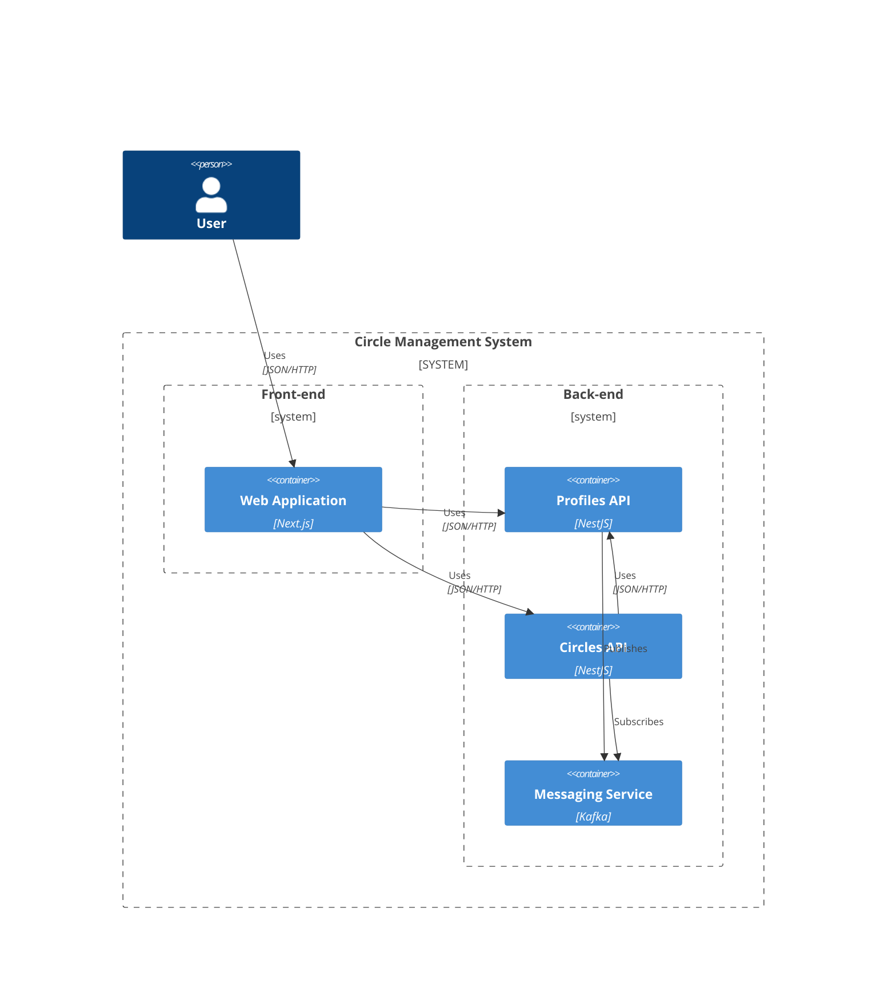

ドメイン駆動設計やアーキテクチャー、マイクロサービス、イベントソーシング、CQRS などのシステム設計を実践的に学習するために、TypeScript を用いたサンプルプロジェクトを作成しました。

## サンプルプロジェクト

@[card](https://github.com/m10maeda/itddd)

### 題材

書籍「[ドメイン駆動設計入門 ボトムアップでわかる! ドメイン駆動設計の基本](https://www.amazon.co.jp/dp/479815072X)」のサンプルプロジェクトである、サークル管理システムを題材としています。

### 要件

題材としている書籍のサンプルプロジェクトとほぼ同等になります。

- プロフィール機能
  - ユーザーを新規登録できること
  - 登録したユーザー情報を閲覧できること
  - 登録したユーザー情報を更新できること
  - 登録したユーザーを削除できること
  - サークルを新規登録できること
- サークル機能
  - 登録したサークル情報を閲覧できること
  - 登録したサークル情報を更新できること
  - 登録したサークルを削除できること
  - 登録したサークルにユーザーを追加できること
  - 登録したサークルからユーザーを除外できること
  - ユーザーを削除した時：
    - サークルから削除したユーザーを除外すること
    - 除外されたユーザーがサークルのオーナーの場合：
      - サークルに他のメンバーがいる場合、他のメンバーをサークルのオーナーに割り当てること
      - サークルに他のメンバーがいない場合、サークルを削除すること

### システム構成



### システム間の連携

プロフィール情報を削除した際にサークルを操作する要件があるため、Profiles API と Circles API の連携が必要となります。システム連携にはメッセージングサービスに Kafka を採用し、プロフィールが削除されたことをメッセージによって通達して処理を行っています。

### 技術スタック

- TypeScript
- Turborepo
- Docker
- Next.js
- NestJS
- Kafka

## ドメインモデル


### プロフィール

ユーザー情報を管理するプロフィール周りのドメインモデルはシンプルに Profile 集約と ProfileEvent で構成しています。


### サークル

サークル情報周りは少し複雑なため、小分けにして説明します。

サークル情報を持つ Circle 集約と、サークルとメンバーの関係性を持つ Relation 集約で構成しています。Relation 集約は、サークルオーナーとなる関係性と一般メンバーとなる関係性の2種類となるよう設計しました。

最終的には Member 集約はなくてもよかったと感じたので、どこかで削除したいと考えています。


ドメインロジックを補完するモデルを足した図が以下となります。


ここで迷った点で、イベントストーミングでいうところのポリシーやコマンドの一部をモデルとして定義しています。モデルとして定義していますが、サービスとして定義するべきだったか今も答えは出ていません。

#### サークルを登録した時、オーナーとなる Relation 集約を作成する

`CreateOwnerRelationIfCircleRegisteredProcess` 周りを抽出したドメインモデル図が以下になります。


1. サークルを登録した際に `CircleRegistered` イベントが発生
2. `CircleRegistered` イベントを購読している `CreateOwnerRelationIfCircleRegisteredProcess` が処理を実行
3. `CreateOwnerRelation` コマンドを呼び出し、`OwnerRelation` 集約を作成

#### サークルを削除した時、そのサークルと関係する Relation 集約を削除する


1. サークルを削除した際に `CircleDeleted` イベントが発生
2. `CircleDeleted` イベントを購読している `DeleteRelationsIfCircleDeletedProcess` プロセスが処理を実行
3. `DeleteRelation` コマンドを呼び出し、`Relation` 集約を作成

#### プロフィールを削除した時、そのプロフィールと関係する Relation 集約を削除する

プロフィールを削除した際に、削除されたメンバーをサークルから除外させるようにしています。プロフィール削除イベントは Circle API の外部で発生するイベントのため、イベントを受けてから Relation 集約を削除するユースケースを呼び出す形になります。

これに関連してドメインロジックとしては、Relation 集約が削除されたことによって引き起こす必要があるロジックは以下になります。

- OwnerRelation が削除された場合、かつサークルに他のメンバーがいる場合はサークルオーナーを変更する
- OwnerRelation が削除された場合、かつサークルに他のメンバーがいない場合はサークルを削除する（メンバー不在となるため）


1. 関係性を削除した際に `RelationDeleted` イベントが発生
2. `RelationDeleted` イベントを購読している `ChangeOwnerOrDeleteCircleIfRelationDeletedProcess` プロセスが処理を実行
3. `ChangeOwner` コマンドを呼び出す
   - 新しいオーナー関係の `OwnerRelation` 集約を作成
   - 前のオーナー関係の `OwnerRelation` 集約を削除

## Profiles API

<!-- markdownlint-disable -->

https://github.com/m10maeda/itddd/tree/e4941fc38d80d81655ca4022bae2093599d252e8/apps/profiles

<!-- markdownlint-enable -->

### アーキテクチャー

Profiles API は、オーソドックスなレイヤードアーキテクチャーの構成を学習するために、依存性逆転の原則を適用したレイヤードアーキテクチャーを採用しています。


### 業務ロジックの実装方法

Profiles API では業務ロジックの実装方法として、オーソドックスな構成を学習する目的でドメインモデル方式を採用しています。集約の復元にはステートソーシングを用い、リポジトリーには永続化指向のアプローチを採用しています。

具体的には、リポジトリーに集約を保存するための振る舞いを定義し、永続化の際にはその振る舞いを明示的に呼び出す設計としています。この振る舞いは、後述するアプリケーションサービスによって呼び出されます。

<!-- markdownlint-disable -->

https://github.com/m10maeda/itddd/blob/e4941fc38d80d81655ca4022bae2093599d252e8/apps/profiles/src/domain/models/profile-repository.ts#L5-L11

https://github.com/m10maeda/itddd/blob/e4941fc38d80d81655ca4022bae2093599d252e8/apps/profiles/src/application/application.service.ts#L74-L86

<!-- markdownlint-enable -->

### ユースケースの実装方法

Profiles API では、ユースケースの実装にアプリケーションサービスを採用しています。具体的には、アプリケーション層に配置したアプリケーションサービスを、ドメイン層に対するファサードパターンとして機能させる形で設計し、システムのユースケースを担っています。


### メッセージングサービスへのメッセージの発行

Profiles API では、外部サービスへメッセージを通知するためにイベントを活用しています。具体的には、`EventSubscriber` の実装クラスとして外部サービスにメッセージを発行するメッセンジャークラスを実装して、購読しているイベントが発生したらメッセージを発行するようにしています。


1. ユースケースのひとつにあたる、アプリケーションサービスのメソッド内で発生したイベントを IEventPublisher へ発行

   ```ts:application.service.ts
   export class ApplicationService {
     public async register(name: string): Promise<string> {
       // ...

       const event = new ProfileRegistered(profile.id, profile.name);
       await this.eventPublisher.publish(event);

       // ...
     }
   }
   ```

2. IEventPublisher の実装クラス、EventBus が登録されている IEventSubscriber へイベントを通達
3. イベントを購読している IEventSubscriber の実装クラスのひとつである、Messenger クラスがイベントを処理して、外部メッセージングサービスにイベントごとのメッセージを発行

   ```ts:messenger.ts
   export class Messenger implements IProfileEventSubscriber<ProfileEvent> {
     private readonly client: ClientKafka;

     public async handle(event: ProfileEvent): Promise<void> {
       // イベントの種別によって発行するメッセージを作成
       const message = this.createMessageBy(event);

       this.send(message);
     }
   }
   ```

## Circles API

<!-- markdownlint-disable -->

https://github.com/m10maeda/itddd/tree/e4941fc38d80d81655ca4022bae2093599d252e8/apps/circles

<!-- markdownlint-enable -->

<!-- markdownlint-disable -->

### アーキテクチャー

<!-- markdownlint-enable -->

Circles API では、応用的な構成を学習する目的で、CQRS とヘキサゴナルアーキテクチャーを意識したレイヤードアーキテクチャーを採用しています。


<!-- markdownlint-disable -->

### 業務ロジックの実装方法

<!-- markdownlint-enable -->

Circles API では業務ロジックの実装方法として、イベント履歴式のドメインモデル方式を採用しています。集約の復元にはイベントソーシングを用いています。そのためリポジトリーにはコレクション指向のアプローチの採用となりました。

Profiles API で採用した永続化指向のアプローチとは違い、コレクション指向のアプローチでは永続化について意識する必要がなく、リポジトリーが集約の取得だけに専念できることが特徴でした。

<!-- markdownlint-disable -->

https://github.com/m10maeda/itddd/blob/e4941fc38d80d81655ca4022bae2093599d252e8/apps/circles/src/domain/models/circle/circle-repository.ts#L6-L10

<!-- markdownlint-enable -->

イベントソーシングの具体的な処理内容としては、集約自体の状態は永続化せず、イベント事態を永続化します。

```ts:in-memory-circle-event-store.ts
export class InMemoryCircleEventStore
  implements ICircleEventSubscriber, ICircleEventLoader {
  private readonly events: CircleEvent[];

  public async handle(event: CircleEvent): Promise<void> {
    // 実際のプロジェクトでは DB や API を使って保存処理を行う
    this.events.push(event);
  }
}
```

リポジトリーから集約を取り出す際は永続化されたイベントを取り出して復元しています。

```ts:circle-repository.ts
export class CircleRepository implements ICircleRepository {
  private readonly eventLoader: ICircleEventLoader;

  public async getBy(id: CircleId): Promise<Circle | undefined> {
    const events = await this.eventLoader.loadAllBy(id);

    return this.replay(events);
  }

  private replay(events: CircleEvent[]): Circle | undefined {
    // イベントを元に集約の復元処理
  }
}
```

本サンプルでは DB を使わずメモリ内に保持するスタブのような実装をしていますが、DB や API を用いた場合でも似たような実装になるかと感じています。

またこのままではイベントが多くなるとパフォーマンスに影響するため、スナップショットを活用することになるかと感じています。

<!-- markdownlint-disable -->

### ユースケースの実装方法

<!-- markdownlint-enable -->

Circles API では、ポートとアダプターを用いてユースケースを実装しています。具体的には、個別のユースケースごとにアプリケーション層でインプットポートとするインターフェースを定義し、ユースケースの振る舞いを定義しています。このインプットポートはプレゼンテーション層のコントローラーから呼び出され、ユースケースを実現するような形になります。


ユースケースのうちコマンドに当たるユースケースをアプリケーション層で Interactor として実装し、クエリーに当たるユースケースはインフラストラクチャー層でクエリーサービスとして実装しています。


### Profiles API との連携

Circles API では、メッセージングサービス（Kafka）から購読しているメッセージを、プレゼンテーション層のコントローラーが受け取るように実装しています。受け取ったメッセージによって、ユースケースを呼び出す形でシステム間の連携を実現しています。

```ts:circle.controller.ts
export class CircleController {
  @EventPattern('profiles', Transport.KAFKA)
  public async handle(@Payload(ValidationPipe) message: ProfileEventDto) {
    if (message.type === EventType.deleted) {
      // プロフィールが削除された際のユースケースを実行
    }
  }
}
```

実際の処理としては、削除されたプロフィールとの関係性を持つ Relation 集約を削除するユースケースを実行します。

## 学びや感想

### 力の入れどころが緩急つけやすい

学習のためのサンプルプロジェクトだったこともありますが、ドメイン層以外の層の実装はだいぶ「動いてそこそこひどくなければいいか」というマインドで実装できました。実際のプロジェクトでもドメインに注力して、他の層に手をかけすぎないようにする、などのバランスが学べたかなと思いました。

### イベントソーシングの難しさ

イベントから集約を復元すること自体は概念的には理解していたのですが、具体的な実装例もあまり見つからず、これでよかったのか今もわかりません。また実際にイベントから復元する際に、削除イベントがあった場合は復元を中止するなどもあり、単純なステートソーシングより難易度は高いと感じました。

肌感ですが、未経験でいきなりイベントソーシングを導入するのは正直怖いな、という感想です。小さいところから経験を積んで取り入れていきたいところかなと思いました。

### 疎結合を保ちやすいイベントによるシステム連携

イベントによるシステム連携はすぐにでも取り入れたいと感じました。

今回の題材で、通常であれば Profiles API 側で Profile を削除したら、その処理に付随して Circle API にメンバー削除などのリクエスト処理を実施する必要があります。
ですがイベントを用いたことで、Profiles API は Circles API の存在を知らなくてもいい状態となり、システム間を疎結合に保ちやすいと感じました。

またこれに関連して、もし追加用件があったとしても、Profiles API に手を加える必要性がほとんどないのも大きな利点と感じています。

### CQRS で集約が純粋になった

CQRS で Read Model と Write Model を分離したことで、集約が純粋にドメインロジックのために必要な情報のみに特化できたと感じました。
